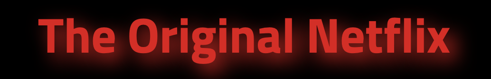
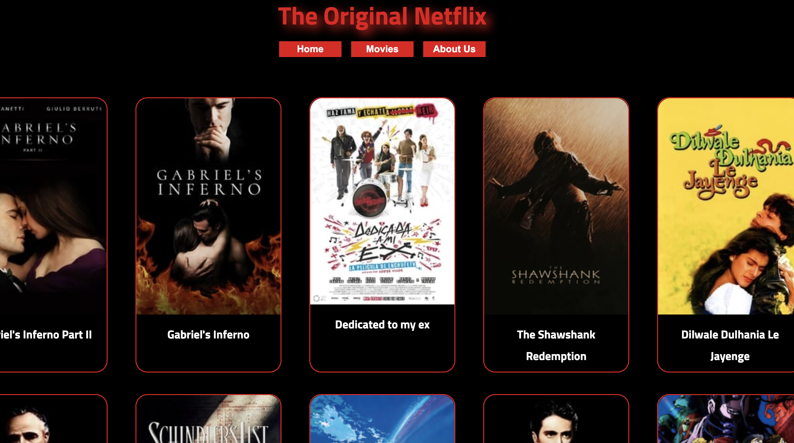

# MovieDb

<!-- PROJECT LOGO -->
 

  

  <h3 align="center">The Original Netflix</h3>
  

    <a href="https://webahead7.github.io/MovieDb/"><strong>Check our website »</strong></a>
  

<!-- TABLE OF CONTENTS -->
## Table of Contents

* [About the Project](#about-the-project)
  * [Built With](#built-with)
* [Getting Started](#getting-started)
* [Roadmap](#roadmap)
* [Contact](#contact)

<!-- ABOUT THE PROJECT -->
## About The Project

  

Movie Db is The New Netflix Site

We provide all the information about your favorite movies , 
In our site you can get the latest news about the movies and box office .

## Built With
* HTML
* CSS
* JS

<!-- GETTING STARTED -->
## Getting Started

Check out the project instructions from WebAhead: [Projet instructions](https://github.com/WebAhead/master-reference/blob/master/coursebook/week-3/project.md)

<!-- CONTACT -->
## Contact

* Mr. Khazen: [@GitHub](https://github.com/jiries-khazen)
* Mr. Azzam:  [@GitHub](https://github.com/nuwrss)
* Mr. Majadly:  [@GitHub](https://github.com/muhammadawwad9)
* Mr. Majadly:  [@GitHub](https://github.com/shoogkabiya)

